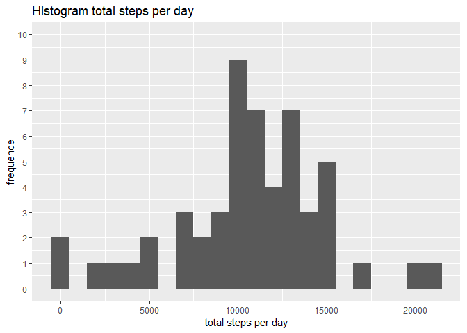
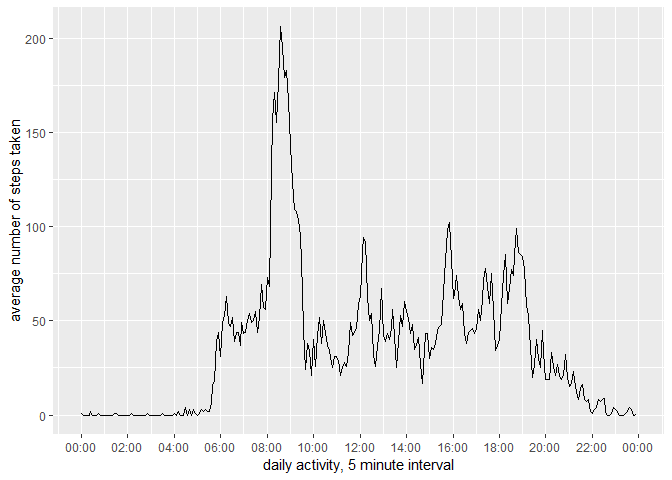
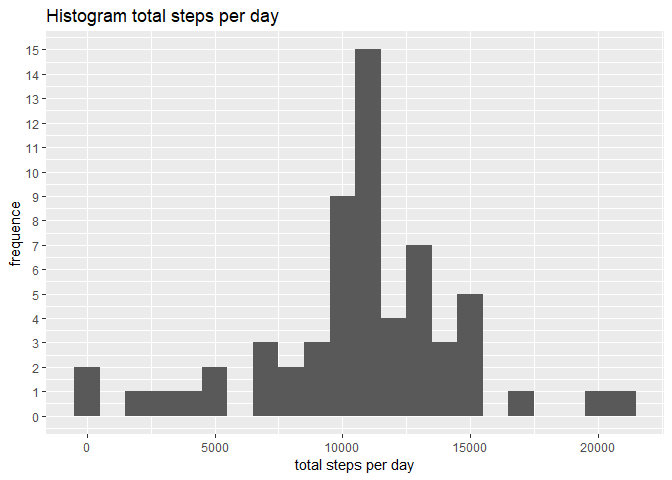
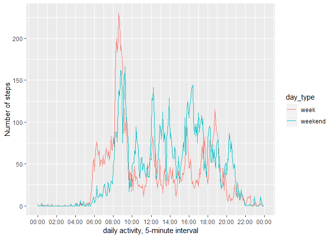

## Loading libraries

```r
library(ggplot2)
library(dplyr)
library(stringr)
```

## Loading and preprocessing the data

```r
activity_data <- read.csv("activity/activity.csv",sep=",")
```

## What is mean total number of steps taken per day?
1. calculate total steps per day

```r
sum_steps_by_day <- aggregate(steps ~ date, activity_data, sum, na.rm = TRUE)
```

2. Make histogram of the totals steps per day

```r
ggplot(data=sum_steps_by_day, aes(steps)) + geom_histogram(binwidth = 1000) + 
  scale_y_continuous(limits = c(0,10), breaks = c(0:10)) +
  ggtitle("Histogram total steps per day") + xlab("total steps per day") + ylab("frequence")
```

<!-- -->

3. Calculate mean and median of the total steps per day
* Mean 10766
* Median 10765

## What is the average daily activity pattern?
1. Calculate average total steps per interval

```r
average_steps_per_interval <- aggregate(steps ~ interval, activity_data, FUN = function(x) as.integer(mean(x)))
names(average_steps_per_interval) <- c("interval", "average_steps")
```

2. Plot average steps per interval

```r
ggplot(average_steps_per_interval, aes(as.POSIXct(str_pad(interval,side="left", pad = "0",width = 4), format = "%H%M"),
  average_steps)) + geom_line() + scale_x_datetime(breaks = "2 hour", date_labels = "%H:%M") +
  xlab("daily activity, 5 minute interval") + ylab("average number of steps taken") 
```

<!-- -->

3. Calculate the 5-minute interval that, on average, contains the maximum number of steps
* 5-minute interval that contains the maximum number op steps 835

## Imputing missing values, missing step values(coded NA) will be replaced by the mean steps value for that interval
1. merge activity data and the average steps data by interval and replace the NA values with the average step value

```r
activity_data_imputed <- merge(activity_data, average_steps_per_interval, by="interval")
activity_data_imputed <- mutate(activity_data_imputed, steps = ifelse(is.na(steps),average_steps,steps))
```

2. calculate total steps per day

```r
sum_steps_by_day <- aggregate(steps ~ date, activity_data_imputed, sum, na.rm = TRUE)
```

3. plot histogram of the totals steps per day

```r
ggplot(data=sum_steps_by_day, aes(steps)) + geom_histogram(binwidth = 1000) + 
  scale_y_continuous(limit = c(0, 15), breaks=c(0:15)) +
  ggtitle("Histogram total steps per day") + xlab("total steps per day") + ylab("frequence")
```

<!-- -->

4. Calculate mean and median if the total steps
* Mean 10750
* Median 10641

## Are there differences in activity patterns between weekdays and weekends?
1. classify date into week or weekend

```r
activity_data_imputed <- mutate(activity_data_imputed, day_type = ifelse(weekdays(as.Date(date)) %in% c("Monday", "Tuesday", "Wednesday", "Thursday", "Friday"), "week", "weekend"))
```

2. calculate average steps per interval for week days and weekend days

```r
average_steps_per_interval <- aggregate(steps ~ interval + day_type, activity_data_imputed, FUN = function(x) as.integer(mean(x)))
```

3. plot average steps per interval for  week days abd weekend days

```r
ggplot(average_steps_per_interval, aes(as.POSIXct(str_pad(interval,side="left", pad = "0",width = 4), format = "%H%M"), steps, color = day_type)) + geom_line() + scale_x_datetime(breaks = "2 hours", date_labels = "%H:%M") +
    xlab("daily activity, 5-minute interval") + ylab("Number of steps")
```

<!-- -->
